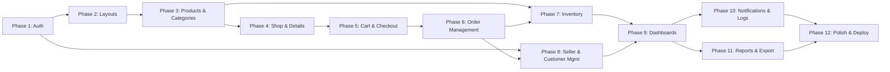

# CommerceHub — AI Coding Agent Prompt Guide

> **Purpose:** This document contains ready-to-use prompts for an AI coding agent to build each module of CommerceHub sequentially. Each prompt is self-contained with full context, constraints, and integration instructions.
>
> **How to Use:** Copy the relevant phase prompt and paste it into your AI coding agent. Execute phases in order — each phase builds upon the previous ones.

---

## Global Rules (Apply to ALL Phases)

Before using any phase prompt, the agent must understand and follow these universal rules:

### Mandatory Rules

1. **Tech Stack — No Substitutions:**
   - Frontend: Next.js (App Router) with React, TypeScript.
   - Styling: Tailwind CSS + Shadcn/UI components.
   - Forms: React Hook Form + Zod validation.
   - Data fetching: TanStack Query (React Query).
   - Backend: Supabase (PostgreSQL, Auth, Storage, RLS).
   - Deployment target: Vercel (frontend), Supabase (backend).

2. **Code Quality Standards:**
   - TypeScript strict mode — no `any` types unless absolutely unavoidable (document why).
   - Every component, hook, utility, and type must be in its own file.
   - Use named exports (not default exports) for all components and utilities.
   - All files use kebab-case naming (`product-card.tsx`, `use-auth.ts`).
   - Components use PascalCase naming (`ProductCard`, `DataTable`).
   - Maximum file length: ~300 lines. Split if larger.
   - No inline styles. All styling via Tailwind CSS classes.
   - No hardcoded strings for user-facing text — use constants.
   - No hardcoded colours or spacing — use design tokens / Tailwind config.

3. **Project Structure (Enforce This):**
   ```
   src/
   ├── app/                    # Next.js App Router pages
   │   ├── (public)/           # Public pages (Home, Shop, About, Contact)
   │   ├── auth/               # Login, Register, Forgot/Reset Password
   │   ├── admin/              # Admin dashboard pages
   │   ├── seller/             # Seller dashboard pages
   │   ├── customer/           # Customer dashboard pages
   │   └── api/                # API routes (if needed)
   ├── components/
   │   ├── ui/                 # Shadcn/UI base components
   │   ├── layout/             # Layout shells (AdminLayout, SellerLayout, etc.)
   │   ├── forms/              # Form components (LoginForm, ProductForm, etc.)
   │   ├── tables/             # Table components (DataTable, columns)
   │   ├── charts/             # Chart wrapper components
   │   └── shared/             # Shared components (ProductCard, StatusBadge, etc.)
   ├── lib/
   │   ├── supabase/           # Supabase client config (client.ts, server.ts, middleware.ts)
   │   ├── validators/         # Zod schemas
   │   └── utils/              # Helper functions
   ├── hooks/                  # Custom React hooks
   ├── services/               # Data fetching functions (Supabase queries)
   ├── types/                  # TypeScript type definitions
   ├── constants/              # App-wide constants
   └── middleware.ts            # Next.js middleware (auth + role guard)
   ```

4. **Responsiveness — Non-Negotiable:**
   - Every component must work on mobile (≥320px), tablet (≥768px), and desktop (≥1024px).
   - Use Tailwind responsive prefixes (`sm:`, `md:`, `lg:`, `xl:`).
   - Touch targets minimum 44px × 44px on mobile.
   - Test all layouts at 375px, 768px, 1024px, 1440px widths.

5. **Security — Always:**
   - Never trust client-side data. Validate on server.
   - All database tables must have RLS policies.
   - Middleware must check auth + role on every protected route.
   - Never expose Supabase service role key on the client.
   - Sanitize all user inputs.

6. **Performance:**
   - Use Next.js `<Image>` for all images (lazy loading, WebP, srcset).
   - Implement loading skeletons for every async data load.
   - Use TanStack Query with appropriate `staleTime` and `gcTime`.
   - Paginate all list/table views (never fetch all records).

### Common Mistakes to Avoid (ALL Phases)

| # | Mistake | Correct Approach |
|---|---|---|
| 1 | Using `useEffect` for data fetching | Use TanStack Query (`useQuery`, `useMutation`) |
| 2 | Putting Supabase queries directly in components | Create service functions in `src/services/`, call from hooks/queries |
| 3 | Using `any` type | Define proper interfaces in `src/types/` |
| 4 | Hardcoding Supabase URL/keys | Use environment variables (`NEXT_PUBLIC_SUPABASE_URL`, `NEXT_PUBLIC_SUPABASE_ANON_KEY`) |
| 5 | Not handling loading/error/empty states | Every data-dependent component needs all three states |
| 6 | Using `<a>` tags for internal links | Use Next.js `<Link>` component |
| 7 | Not adding `key` props in lists | Always use unique, stable keys (database IDs, not array indices) |
| 8 | Fetching all data client-side | Use SSR/SSG for public pages (Home, Shop, Product Details) for SEO |
| 9 | Giant monolithic components | Break into small, focused components (< 150 lines ideally) |
| 10 | Not wrapping mutations in try/catch | Always handle errors gracefully with user feedback (toast) |
| 11 | Inline Zod schemas | Define schemas in `src/lib/validators/` and import them |
| 12 | Not implementing RLS | Every table MUST have RLS enabled with proper policies |
| 13 | Using native HTML `<select>` | Use Shadcn/UI `<Select>` for consistent styling |
| 14 | Not debouncing search inputs | Debounce all real-time search/filter inputs (300ms) |
| 15 | Not syncing filters with URL params | Shop page filters, sort, and pagination must be in URL query params |

---

---

## Phase 1 Prompt: Project Setup & Authentication

---

```
You are building "CommerceHub" — a multi-role e-commerce management platform.

## CONTEXT

Read these reference documents before writing any code:
- PRD: @PRD.md (full project requirements)
- Design Spec: @design.md (UI/UX design system, tokens, layout rules)
- Module PRD: @development phase/01-authentication-authorization.md (detailed auth requirements)

## WHAT TO BUILD IN THIS PHASE

### Step 1: Project Initialization
- Initialize a Next.js 14+ project with App Router, TypeScript, Tailwind CSS, and ESLint.
- Install and configure Shadcn/UI (use "New York" style, slate neutral colour).
- Install dependencies: @supabase/supabase-js, @supabase/ssr, @tanstack/react-query, react-hook-form, @hookform/resolvers, zod, lucide-react.
- Set up the folder structure exactly as defined in the Global Rules above.
- Configure Tailwind with the design tokens from design.md (colours, spacing, typography, shadows, radii).
- Set up environment variables: NEXT_PUBLIC_SUPABASE_URL, NEXT_PUBLIC_SUPABASE_ANON_KEY.
- Create Supabase client utilities:
  - `src/lib/supabase/client.ts` — browser client.
  - `src/lib/supabase/server.ts` — server-side client.
  - `src/lib/supabase/middleware.ts` — middleware client.
- Set up TanStack Query provider wrapping the app.

### Step 2: Database Schema (Supabase SQL)
- Create the `profiles` table with all fields from the module PRD (id, email, full_name, phone, avatar_url, role, status, business_name, created_at, updated_at).
- Create a database trigger: `on_auth_user_created` that auto-inserts a row into `profiles` when a new Supabase Auth user is created. The trigger should read role from user metadata.
- Enable RLS on `profiles` with policies:
  - Users can SELECT their own profile.
  - Users can UPDATE their own profile (except role and status).
  - Admins can SELECT and UPDATE all profiles.
- Seed the first admin user via SQL migration.

### Step 3: Authentication Pages
Build these pages using the design spec (centered card layout, Inter font, design tokens):
- `/auth/login` — Email + Password form. "Remember me" checkbox. "Forgot password?" link. "Register" link.
- `/auth/register` — Role selector (Customer default, Seller option). Full Name, Email, Password, Confirm Password. Seller shows Business Name + Phone. Password strength indicator.
- `/auth/forgot-password` — Email input. Sends reset via Supabase.
- `/auth/reset-password` — New password + confirm. Accessed via email link.

### Step 4: Auth Logic & Middleware
- Create `src/hooks/use-auth.ts` — custom hook using TanStack Query for current user session + profile.
- Create `src/middleware.ts`:
  - Check if user is authenticated on all `/admin/*`, `/seller/*`, `/customer/*` routes.
  - If not authenticated → redirect to `/auth/login`.
  - If authenticated → fetch role from profile → validate against route.
  - Admin routes: role must be "admin".
  - Seller routes: role must be "seller" AND status must be "active".
  - Customer routes: role must be "customer".
  - Wrong role → redirect to their correct dashboard.
- Create auth service: `src/services/auth-service.ts` with functions for signUp, signIn, signOut, resetPassword, updatePassword.

### Step 5: Post-Auth Routing
- After login: read user role → redirect:
  - admin → /admin/dashboard
  - seller (active) → /seller/dashboard
  - seller (pending) → /seller/pending-approval (create this page — static message)
  - seller (suspended) → /seller/suspended (create this page — static message)
  - customer → /
- After registration: customer → /, seller → /seller/pending-approval.
- Create placeholder dashboard pages (just a heading "Admin Dashboard", "Seller Dashboard", "Customer Dashboard") — they'll be built in later phases.

## CONSTRAINTS
- Clean, modular code. Every component in its own file.
- All forms validated with Zod schemas (defined in `src/lib/validators/auth.ts`).
- All Supabase queries in `src/services/auth-service.ts`, not in components.
- Full TypeScript types in `src/types/auth.ts` and `src/types/database.ts`.
- Responsive: auth pages must look perfect on mobile and desktop.
- Loading states on all buttons during API calls.
- Toast notifications for success/error feedback (use Shadcn/UI toast).
- Handle all edge cases from the module PRD (duplicate email, expired reset link, etc.).

## DO NOT
- Do not build any dashboard content yet (only placeholder pages).
- Do not create product, order, or cart tables yet.
- Do not build any navigation bars or layout shells yet (those come in Phase 2).
- Do not use any payment API.
- Do not skip RLS policies.
```

---

---

## Phase 2 Prompt: Layouts, Navigation & Public Website Shell

---

```
You are continuing to build "CommerceHub." Phase 1 (Auth) is complete.

## CONTEXT

Read these reference documents:
- PRD: @PRD.md
- Design Spec: @design.md (pay close attention to Section 4: Layout Structure and Section 6.5: Navigation Components)
- Module PRD: @development phase/02-public-website.md
- Previous work: Phase 1 built auth pages, Supabase client, middleware, profiles table, and placeholder dashboard pages.

## WHAT TO BUILD IN THIS PHASE

### Step 1: Layout Shells (Reusable Across All Future Phases)

Build three layout components in `src/components/layout/`:

**A. PublicLayout (`public-layout.tsx`)**
- Top navigation bar (sticky, 64px height):
  - Left: Logo/brand name linking to Home.
  - Center: Nav links — Home, Shop, Categories, About, Contact.
  - Right: Search icon, Cart icon (with badge — static "0" for now), User avatar/icon (login link if unauthenticated, dropdown if authenticated).
  - Mobile: Hamburger menu → slide-in drawer from left.
  - On Home page hero: Transparent nav with white text, transitions to solid on scroll.
- Footer:
  - Dark background. 4-column grid (brand + description + socials, Quick Links, Customer Service, Newsletter signup).
  - Bottom bar: Copyright, Terms, Privacy.
  - Responsive: 4 cols → 2 cols → 1 col.

**B. DashboardLayout (`dashboard-layout.tsx`)**
- For Admin and Seller dashboards.
- Fixed sidebar (260px expanded, 72px collapsed):
  - Admin sidebar: Dark background (slate-900). Items: Dashboard, Sellers, Customers, Products, Categories, Orders, Reports, Notifications, Activity Logs, Settings.
  - Seller sidebar: Light background. Items: Dashboard, Products, Inventory, Orders, Analytics, Settings.
  - Each item: Lucide icon + label. Active item highlighted with accent colour.
  - Collapse toggle at bottom.
  - Profile info at bottom (avatar + name + role badge).
- Top bar (60px, right of sidebar):
  - Breadcrumbs (dynamic based on route).
  - Global search input.
  - Notification bell (static icon for now — functional in Phase 10).
  - Profile avatar dropdown (My Profile, Settings, Logout).
- Content area: Scrollable, padded, max-width 1400px.
- Mobile: Sidebar hidden, hamburger toggle overlays.
- The layout accepts a `role` prop ("admin" | "seller") to switch accent colours and nav items.

**C. CustomerDashboardLayout (`customer-dashboard-layout.tsx`)**
- Uses the same PublicLayout top nav.
- Adds a slim side nav (220px, light background) with: Dashboard, My Orders, Profile, Addresses, Wishlist, Settings.
- Mobile: Side nav becomes horizontal tabs at top.

### Step 2: Public Pages (Content)

**Home Page (`src/app/(public)/page.tsx`)**
- Hero banner: Full-width gradient/image background, headline text, "Shop Now" CTA button. Responsive.
- Featured Products section: Heading + horizontal scroll/grid of 4-8 ProductCard components. Use MOCK DATA for now (create `src/constants/mock-data.ts` with 8 sample products).
- Popular Categories: Grid of 6 category cards (icon + name). Mock data.
- New Arrivals: Grid of 4-8 ProductCards. Mock data.
- Best Sellers: Grid of 4-8 ProductCards. Mock data.
- All sections are responsive.

**Product Card Component (`src/components/shared/product-card.tsx`)**
- Reusable across the entire app. Takes product data as props.
- Image (4:3 aspect ratio, object-cover), Wishlist heart icon (top-right), Sale badge (top-left if discounted).
- Category label, Product name (2-line clamp), Price (current + original strikethrough + discount badge).
- "Add to Cart" button (appears on hover for desktop, always visible on mobile).
- Hover: Image scales slightly, shadow deepens.
- Fully typed props with TypeScript interface.

**About Page (`src/app/(public)/about/page.tsx`)**
- Static editorial content. Company story, mission, values.
- Clean layout with generous whitespace.

**Contact Page (`src/app/(public)/contact/page.tsx`)**
- Two-column: Contact form (Name, Email, Subject, Message) + Contact info (email, phone, address).
- Form validated with Zod. On submit: show success toast (no backend for contact form yet).

### Step 3: Apply Layouts to Routes
- Wrap all `(public)` routes with PublicLayout.
- Wrap `/admin/*` routes with DashboardLayout (role="admin").
- Wrap `/seller/*` routes with DashboardLayout (role="seller").
- Wrap `/customer/*` routes with CustomerDashboardLayout.
- Auth pages (`/auth/*`) use no layout shell (standalone centered cards).

## CONSTRAINTS
- Layouts MUST be fully responsive (test at 375px, 768px, 1024px, 1440px).
- Sidebar collapse/expand must animate smoothly (250ms transition).
- Navigation components must be reusable and data-driven (nav items from a config array, not hardcoded JSX).
- ProductCard must be a single reusable component used everywhere products are displayed.
- Use Lucide icons consistently (import from lucide-react).
- Footer newsletter form is UI-only (no backend).
- All mock data must be typed with TypeScript interfaces from `src/types/`.
- Implement proper SEO: unique <title> and <meta description> per page. Semantic HTML (nav, main, aside, footer, section, article).

## INTEGRATION WITH PHASE 1
- Use the `useAuth` hook from Phase 1 to conditionally show Login/Register vs Profile dropdown in the top nav.
- Logout action in the profile dropdown calls the auth service signOut function.
- DashboardLayout middleware already protects routes (built in Phase 1).

## DO NOT
- Do not build the Shop page product grid with filters yet (Phase 3).
- Do not connect to real database for products yet — use mock data.
- Do not build cart functionality — just the cart icon with a static badge.
- Do not build notification dropdown content — just the bell icon.
- Do not build any dashboard page content — only the layout shell + placeholder content.
```

---

---

## Phase 3 Prompt: Category Management & Product Management

---

```
You are continuing to build "CommerceHub." Phases 1-2 are complete.

## CONTEXT

Read these reference documents:
- PRD: @PRD.md
- Design Spec: @design.md (Section 6: Component Design System — especially Tables, Forms, Modals)
- Module PRDs:
  - @development phase/08-category-management.md
  - @development phase/03-product-management.md
- Previous work: Phase 1 (auth, profiles table, middleware), Phase 2 (layouts, navigation, public page shells, ProductCard component).

## WHAT TO BUILD IN THIS PHASE

### Step 1: Database Schema

**categories table:**
- id (UUID, PK), name (TEXT, UNIQUE, NOT NULL), slug (TEXT, UNIQUE, NOT NULL), image (TEXT, nullable), parent_id (UUID, FK → categories.id, nullable), sort_order (INTEGER, DEFAULT 0), created_at, updated_at.
- RLS: Public SELECT (anyone reads). INSERT/UPDATE/DELETE: admin only.

**products table:**
- id (UUID, PK), seller_id (UUID, FK → profiles.id, NOT NULL), category_id (UUID, FK → categories.id, NOT NULL), name (TEXT, NOT NULL), description (TEXT, NOT NULL), sku (TEXT, nullable), price (NUMERIC(10,2), NOT NULL, CHECK > 0), discount (NUMERIC(5,2), DEFAULT 0, CHECK 0-99), stock (INTEGER, NOT NULL, DEFAULT 0, CHECK >= 0), featured (BOOLEAN, DEFAULT false), status (TEXT, DEFAULT 'draft', CHECK: draft/active/pending_approval/rejected/deleted), rejection_reason (TEXT, nullable), image_url (TEXT, nullable), images (TEXT[], nullable), created_at, updated_at.
- RLS:
  - Public SELECT: status = 'active' only.
  - Seller SELECT: own products (any status).
  - Seller INSERT: seller_id must match auth.uid().
  - Seller UPDATE/DELETE: own products only.
  - Admin: full access.

**Supabase Storage:** Create bucket `product-images` with public access for reading.

### Step 2: Category Management (Admin)

**Page: `/admin/categories`**
- Tree view / nested list showing parent-child categories.
- Each row: Category image/icon, Name, Product count (query from products), Actions (Edit, Delete).
- Search: Filter by name.
- "+ Add Category" button → opens a modal form:
  - Fields: Name, Parent Category (dropdown of top-level categories, or "None" for top-level), Image upload (single image to Supabase Storage).
  - Validated with Zod.
  - On save: Insert into categories. Toast success. Refresh list.
- Edit: Same modal, pre-filled. Update on save.
- Delete: Confirmation dialog. If category has products → show warning, block deletion or prompt reassignment. If category has children → prompt to delete children too.

**Build these service files:**
- `src/services/category-service.ts` — CRUD functions for categories.
- `src/lib/validators/category.ts` — Zod schemas.
- `src/types/category.ts` — TypeScript interfaces.

### Step 3: Seller Product Management

**Page: `/seller/products` — Product List**
- DataTable component (build a reusable `DataTable` in `src/components/tables/data-table.tsx`):
  - Uses @tanstack/react-table for sorting, filtering, pagination.
  - Columns: Thumbnail (product image), Name, Category, Price, Stock, Status (badge), Created Date, Actions (Edit, Delete — kebab menu).
  - Search by product name.
  - Filter by Status, Category.
  - Pagination: 10/25/50 per page.
  - Only shows products where seller_id = current user (RLS enforces this).
  - Empty state: "You haven't added any products yet." + "+ Add Product" CTA.

**Page: `/seller/products/new` — Add Product**
- Multi-section form:
  - Section 1 — Basic Info: Name (input), Description (textarea), Category (searchable select, data from categories table).
  - Section 2 — Pricing: Price (number input), Discount % (number input), SKU (text, auto-generate if blank).
  - Section 3 — Inventory: Stock quantity (number input).
  - Section 4 — Images: Drag-and-drop upload zone. Accept JPEG/PNG/WebP, max 5MB, max 5 files. Upload to Supabase Storage `product-images/{seller_id}/{product_id}/`. Show upload progress. Preview strip with delete (×).
  - Section 5 — Settings: Status toggle (Draft/Active), Featured toggle.
- Zod validation for all fields.
- On save: Upload images first → get URLs → insert products row. Redirect to product list. Toast success.

**Page: `/seller/products/[id]/edit` — Edit Product**
- Same form as Add, pre-filled. Existing images shown with delete option. Can add new images.
- On save: Update products row. Redirect to list. Toast.

**Delete Product:**
- Confirmation dialog from the product list.
- Soft delete: Set status = 'deleted'. Remove images from storage.
- Toast: "Product deleted."

### Step 4: Admin Product Moderation

**Page: `/admin/products`**
- DataTable showing ALL products across all sellers.
- Additional columns: Seller Name. Filter by Seller.
- Actions per product:
  - Approve: Set status = 'active'. Toast.
  - Reject: Dialog with required reason text input. Set status = 'rejected', store rejection_reason. Toast.
  - Feature: Toggle featured flag. Toast.
  - Delete: Confirmation → soft delete.
- Click row → slide-over panel showing full product details + images.

**Build these service/type files:**
- `src/services/product-service.ts`
- `src/lib/validators/product.ts`
- `src/types/product.ts`

## CONSTRAINTS
- The DataTable component MUST be generic and reusable (used again in Orders, Customers, Sellers, Inventory, Activity Logs). Build it properly now with column definitions, sorting, filtering, pagination, and row actions.
- All forms use React Hook Form + Zod. No uncontrolled form patterns.
- Image upload must show per-file progress and handle failures gracefully (retry button).
- StatusBadge component (`src/components/shared/status-badge.tsx`) — reusable component for all status displays. Takes status string → returns coloured badge.
- Category select must be searchable for good UX.
- Responsive: Forms are single-column on mobile, can be two-column on desktop. Tables convert to stacked cards on mobile.

## INTEGRATION WITH PREVIOUS PHASES
- Use DashboardLayout (admin) from Phase 2 for all admin pages.
- Use DashboardLayout (seller) from Phase 2 for all seller pages.
- Breadcrumbs in the top bar should dynamically update for these new pages.
- ProductCard component (Phase 2) is NOT used here — it's for the public shop. Admin/seller views use DataTable.

## DO NOT
- Do not build the public Shop page yet (Phase 4).
- Do not build inventory management page yet (Phase 7) — only the stock field in the product form.
- Do not build order-related features.
- Do not skip building the reusable DataTable — it is critical for future phases.
```

---

---

## Phase 4 Prompt: Public Shop & Product Details

---

```
You are continuing to build "CommerceHub." Phases 1-3 are complete.

## CONTEXT

Read these reference documents:
- Design Spec: @design.md (Section 5.1: Public Pages — Shop and Product Details)
- Module PRD: @development phase/02-public-website.md (Features F2.4 and F2.5)
- Previous work: Phase 3 built the categories table, products table, Supabase Storage for images, and product CRUD. Real product data now exists in the database.

## WHAT TO BUILD IN THIS PHASE

### Step 1: Replace Mock Data on Home Page
- Replace the mock data on the Home page (Phase 2) with real Supabase queries:
  - Featured Products: `products WHERE featured = true AND status = 'active' LIMIT 8`.
  - New Arrivals: `products WHERE status = 'active' ORDER BY created_at DESC LIMIT 8`.
  - Popular Categories: `categories WHERE parent_id IS NULL LIMIT 6` with product count.
  - Best Sellers: Aggregate from order_items (or use stock as proxy for now — real order data comes later).
- Use SSR (Server Components) for SEO. Fetch data server-side.

### Step 2: Shop Page (`/shop`)
- **Layout:** Filter sidebar (left, 25%) + Product grid (right, 75%).
- **Search Bar:** Top of page. Debounced (300ms). Searches product name and description using Supabase `ilike` or full-text search.
- **Filter Sidebar:**
  - Category filter: Checkbox list of all categories (show parent > child hierarchy). Fetched from categories table.
  - Price Range: Min and max number inputs.
  - Stock: Toggle — "In Stock Only" (filters out stock = 0).
- **Active Filters:** Shown as removable chips above the product grid. Clicking "×" removes that filter.
- **Sorting Dropdown:** Latest (created_at DESC), Price: Low → High, Price: High → Low. (Best Selling deferred until orders exist.)
- **Product Grid:** Responsive grid of ProductCard components (from Phase 2). auto-fill, minmax(260px, 1fr).
- **Pagination:** Bottom of grid. "Showing X-Y of Z" + page numbers. 12 products per page.
- **URL Sync:** All filters, sort, search query, and page number must be reflected in URL query parameters (?category=x&min_price=100&sort=price_asc&page=2). This enables shareability and back-button support.
- **Mobile:** Filter sidebar collapses. Show a "Filters" button that opens a bottom sheet/drawer with all filter controls. Apply/Clear buttons.
- **SSR:** Initial page load is server-rendered for SEO. Filter changes are client-side (update URL params + refetch).
- **Empty state:** "No products found" + "Clear all filters" button.

### Step 3: Product Details Page (`/products/[id]`)
- **SSR** with dynamic metadata (title = product name, description = product description, Open Graph image = product image).
- **Breadcrumb:** Home > Category Name > Product Name.
- **Layout:** Two columns — Image gallery (55%) + Product info (45%). Stacked on mobile.
- **Image Gallery:**
  - Main large image (aspect ratio maintained).
  - Thumbnail strip below. Click thumbnail → swap main image.
  - If product has no images → show placeholder.
- **Product Info:**
  - Product name (h1).
  - Category badge (linked to shop filtered by category).
  - Price display: Current price (large, bold) + Original price (strikethrough if discount > 0) + Discount badge (e.g., "30% OFF" in red pill).
  - Description (full text, properly formatted).
  - SKU (small, muted text).
  - Stock status: "In Stock" (green), "Low Stock — Only X left" (amber, if stock ≤ 10), "Out of Stock" (red).
  - Quantity selector: Number input with −/+ buttons. Min 1, max = available stock. Disabled if out of stock.
  - "Add to Cart" button: Primary, large. Disabled if out of stock. Shows "Out of Stock" text when disabled. (Cart functionality is UI-only for now — toast "Added to cart!" but no actual cart logic until Phase 5.)
  - Wishlist heart icon button (UI-only for now).
- **Related Products:** Grid of 4 ProductCards from the same category (exclude current product).
- **Mobile:** Stacked layout — images on top, info below. Sticky "Add to Cart" bar at bottom of screen.

### Step 4: Categories Page (`/categories`)
- Grid of category cards (image/icon + name + product count).
- Click → navigate to `/shop?category=[id]`.
- Show parent categories. If a parent has children, show them as sub-items or navigate to shop filtered.

### Step 5: Product Service Queries
Create these query functions in `src/services/product-service.ts` (extend from Phase 3):
- `getProducts(filters)` — Paginated, filtered, sorted product list for shop page.
- `getProductById(id)` — Single product with category and seller info.
- `getFeaturedProducts()` — Featured products for home page.
- `getNewArrivals()` — Latest products.
- `getRelatedProducts(categoryId, excludeId)` — Related products.
- `searchProducts(query)` — Full-text search.

## CONSTRAINTS
- Shop page must be fast. Use SSR for initial load, client-side fetching for filter changes.
- URL params must be the source of truth for filters — not React state. Use `useSearchParams` and `useRouter`.
- ProductCard component from Phase 2 must be reused without modification (or with minimal prop additions).
- Image gallery must handle 1 image, multiple images, and 0 images gracefully.
- Price calculations: effective_price = price × (1 - discount/100). Display both original and effective prices.
- All public pages must have proper SEO meta tags.

## INTEGRATION WITH PREVIOUS PHASES
- Use PublicLayout from Phase 2.
- Use ProductCard component from Phase 2.
- Products and categories data from Phase 3 database tables.
- Auth state from Phase 1 (show login prompt if unauthenticated user clicks "Add to Cart").

## DO NOT
- Do not implement actual cart logic (adding items to database) — that's Phase 5. Just show a toast.
- Do not implement wishlist logic — just the UI heart icon.
- Do not implement product reviews/ratings.
- Do not build any seller or admin features in this phase.
```

---

---

## Phase 5 Prompt: Shopping Cart & Checkout

---

```
You are continuing to build "CommerceHub." Phases 1-4 are complete.

## CONTEXT

Read these reference documents:
- Design Spec: @design.md (Section 6.2: Cards — Order Card)
- Module PRD: @development phase/04-shopping-cart-checkout.md (complete module)
- Previous work: Phase 4 built the Shop page and Product Details page with "Add to Cart" button (currently shows a toast only).

## WHAT TO BUILD IN THIS PHASE

### Step 1: Database Schema

**cart table:**
- id (UUID, PK), customer_id (UUID, FK → profiles.id, NOT NULL), product_id (UUID, FK → products.id, NOT NULL), quantity (INTEGER, NOT NULL, CHECK > 0), created_at.
- UNIQUE constraint on (customer_id, product_id).
- RLS: SELECT/INSERT/UPDATE/DELETE only where customer_id = auth.uid().

**addresses table:**
- id (UUID, PK), customer_id (UUID, FK → profiles.id, NOT NULL), full_name, phone, address_line_1, address_line_2 (nullable), city, state, pincode (CHECK 6 digits), is_default (BOOLEAN, DEFAULT false), created_at.
- RLS: CRUD only where customer_id = auth.uid().

**orders table:**
- id (UUID, PK), order_number (TEXT, UNIQUE — format: ORD-YYYYMMDD-XXXX), customer_id (UUID, FK), seller_id (UUID, FK), status (TEXT, DEFAULT 'pending', CHECK: pending/confirmed/packed/shipped/delivered/cancelled), subtotal, shipping_cost (DEFAULT 0), total, address (JSONB — snapshot), created_at, updated_at.
- RLS: Customers see own orders. Sellers see orders where seller_id matches. Admins see all.

**order_items table:**
- id (UUID, PK), order_id (UUID, FK → orders.id), product_id (UUID, FK), product_name (TEXT — snapshot), product_image (TEXT — snapshot), quantity, price (NUMERIC — snapshot), total.
- RLS: Same as orders (via order_id join).

**order_status_history table:**
- id (UUID, PK), order_id (UUID, FK), status (TEXT), changed_by (UUID, FK → profiles.id), note (TEXT, nullable), created_at.
- RLS: Same as orders.

### Step 2: Cart Functionality

**Connect "Add to Cart" (Product Details & ProductCard):**
- If user is not authenticated → redirect to `/auth/login?redirect=/products/[id]`.
- If authenticated → upsert into cart table (increment quantity if product already in cart).
- Validate: quantity cannot exceed product stock.
- Toast: "Added to cart!"
- Update cart badge count in navigation (use TanStack Query to invalidate cart query).

**Cart Page (`/cart`):**
- Layout: Cart items list (65% left) + Cart summary (35% right).
- Each cart item: Product thumbnail (linked to product page), Name, Unit price, Quantity controls (−/+ buttons with number between), Line total (price × qty), Remove (×) button.
- Quantity controls: Min 1, Max = product stock. At quantity 1, clicking "−" prompts removal.
- Remove item: Instant removal + undo toast (5-second undo window).
- Cart summary: Subtotal, Shipping (Free), Total, "Proceed to Checkout" button.
- Empty cart: Illustration + "Your cart is empty" + "Continue Shopping" CTA.
- Mobile: Summary becomes sticky bottom bar.

**Cart Badge (Navigation):**
- Update the cart icon badge in PublicLayout top nav to show real count from cart table.
- Use TanStack Query with a cart count query. Invalidate on add/remove/update.

### Step 3: Checkout Flow

**Checkout Page (`/checkout`) — 3-Step Flow:**

**Step 1 — Shipping Address:**
- Progress bar: ① Address → ② Review → ③ Confirmation (Step 1 active).
- If user has saved addresses → show address cards. Pre-select default.
- "Add New Address" → inline form or modal. Fields: Full Name, Phone, Address Line 1, Line 2, City, State, Pincode. Zod validation.
- Save new address to addresses table + select it.
- "Continue" button → Step 2.

**Step 2 — Order Review:**
- Progress bar: Step 2 active.
- Cart items summary (read-only list).
- Selected address displayed.
- Payment method: "Cash on Delivery" (display only, pre-selected).
- Price breakdown: Subtotal, Shipping, Total.
- "Change Address" link → back to step 1. "Edit Cart" link → back to cart.
- "Place Order" button (primary, large).

**Step 3 — Order Placement (on "Place Order" click):**
- Button shows loading spinner.
- Server-side logic (use Next.js API route or Supabase RPC function):
  1. Re-validate stock for all cart items.
  2. Group cart items by seller_id.
  3. For each seller group:
     a. Create an `orders` row.
     b. Create `order_items` rows.
     c. Create initial `order_status_history` entry (status: 'pending').
  4. Decrement stock on each product.
  5. Clear the user's cart.
  6. Use a database transaction — all or nothing.
- On success → redirect to `/checkout/confirmation/[order_id]`.
- On failure → error toast, cart preserved.

**Order Confirmation Page (`/checkout/confirmation/[order_id]`):**
- Success animation/checkmark.
- Order number displayed.
- Order summary.
- "Continue Shopping" + "View My Orders" CTAs.

### Step 4: Services & Types
- `src/services/cart-service.ts` — addToCart, removeFromCart, updateQuantity, getCartItems, getCartCount, clearCart.
- `src/services/order-service.ts` — createOrder, getOrderById.
- `src/services/address-service.ts` — CRUD operations.
- `src/lib/validators/checkout.ts` — Address schema, order schema.
- `src/types/cart.ts`, `src/types/order.ts`, `src/types/address.ts`.

## CONSTRAINTS
- Cart must persist across sessions (database, not localStorage).
- Order creation MUST be a database transaction. If stock decrement fails, no order is created.
- Address is snapshot into the order as JSONB — not a reference. Address changes after order placement do not affect existing orders.
- Order number generation must be human-readable and unique.
- Multi-seller cart: If cart has items from 3 sellers, checkout creates 3 separate orders.
- Stock validation must happen BOTH client-side (UI) and server-side (transaction).
- Checkout progress bar must show current step clearly.

## INTEGRATION WITH PREVIOUS PHASES
- Product Details page "Add to Cart" button (Phase 4) now connects to real cart logic.
- ProductCard "Add to Cart" connects similarly.
- Cart badge in PublicLayout (Phase 2) now shows real count.
- Use auth state (Phase 1) to gate cart operations.

## DO NOT
- Do not implement payment gateway — COD only.
- Do not build order management for sellers/admins yet (Phase 6).
- Do not build customer order history page yet (Phase 6).
- Do not implement real-time stock updates.
```

---

---

## Phase 6 Prompt: Order Management (All Roles)

---

```
You are continuing to build "CommerceHub." Phases 1-5 are complete.

## CONTEXT

Read these reference documents:
- Design Spec: @design.md (Section 6.4: Data Tables, Section 6.6: Modals & Dialogs — Slide-over)
- Module PRD: @development phase/05-order-management.md
- Previous work: Phase 5 created orders, order_items, and order_status_history tables and the checkout flow.

## WHAT TO BUILD IN THIS PHASE

### Step 1: Customer — Order History & Details

**Page: `/customer/orders`**
- List of order cards (not a table — cards are more customer-friendly).
- Each card: Order number, date, status badge (StatusBadge component from Phase 3), total, product thumbnails (first 3 + "+N more"), seller name.
- Filter tabs: All | Pending | Confirmed | Shipped | Delivered | Cancelled.
- Pagination: 10 per page.
- Empty state: "No orders yet. Start shopping!"

**Page: `/customer/orders/[id]`**
- Full order detail page (not slide-over — full page for customers).
- Order info: Number, date, status badge, payment (COD).
- Items list: Thumbnail, name, quantity, unit price, line total.
- Delivery address (from JSONB snapshot).
- Price breakdown: Subtotal, shipping, total.
- Order timeline: Vertical timeline component showing all status changes with timestamps.
- Seller info.

### Step 2: Seller — Order Management

**Page: `/seller/orders`**
- DataTable (reuse from Phase 3). Columns: Order Number, Customer Name, Items Count, Total, Status (badge), Date, Actions.
- Filter tabs: All | Pending | Confirmed | Packed | Shipped | Delivered | Cancelled.
- Search: By order number or customer name.
- Pagination.
- Click row → Slide-over panel from the right.

**Slide-over: Order Detail Panel**
- Build a reusable `SlideOverPanel` component in `src/components/shared/slide-over-panel.tsx`.
- Content: Order info, customer info (name, phone, address), items list with thumbnails, price breakdown, status timeline.
- **Status Update:** Dropdown showing only valid next statuses (use the transition rules from the module PRD). "Update Status" button. Confirmation dialog on click. On confirm: update orders.status, insert order_status_history entry, toast success.
- On cancellation: Restore product stock (increment). Require cancellation reason.

### Step 3: Admin — Global Order Management

**Page: `/admin/orders`**
- Same DataTable as seller but shows ALL orders. Additional column: Seller Name. Additional filter: By seller.
- Same slide-over detail panel.
- Admin can update status with same rules.

### Step 4: Order Timeline Component
- Build `src/components/shared/order-timeline.tsx`.
- Vertical timeline with nodes for each status change.
- Each node: Status icon (coloured), status label, timestamp, actor name.
- Completed steps: Solid colour. Current: Highlighted/pulsing. Future: Grey.
- Reused in customer order details, seller slide-over, admin slide-over.

### Step 5: Services
- Extend `src/services/order-service.ts`:
  - getCustomerOrders(filters, pagination)
  - getSellerOrders(filters, pagination)
  - getAllOrders(filters, pagination) — admin
  - getOrderDetails(orderId)
  - updateOrderStatus(orderId, newStatus, note?)
  - getOrderTimeline(orderId)

## CONSTRAINTS
- Status transitions must be validated both client-side (dropdown options) and server-side (RPC or API route).
- The SlideOverPanel must be reusable (it will be used again for seller details and customer details in later phases).
- OrderTimeline must be a reusable component.
- Stock restoration on cancellation must be atomic (transaction).

## INTEGRATION WITH PREVIOUS PHASES
- Use DataTable from Phase 3. Use StatusBadge from Phase 3.
- Use DashboardLayout (Phase 2) for seller and admin pages.
- Use CustomerDashboardLayout (Phase 2) for customer pages.
- Orders data created in Phase 5 checkout.

## DO NOT
- Do not build notifications for order status changes yet (Phase 10).
- Do not build order-related reports yet (Phase 11).
- Do not implement real-time order updates.
```

---

---

## Phase 7 Prompt: Inventory Management

---

```
You are continuing to build "CommerceHub." Phases 1-6 are complete.

## CONTEXT

Read these reference documents:
- Module PRD: @development phase/06-inventory-management.md
- Previous work: Products table has a `stock` field. Orders decrement stock on placement. Cancellations restore stock.

## WHAT TO BUILD IN THIS PHASE

### Step 1: Database Schema

**stock_history table:**
- id (UUID, PK), product_id (UUID, FK → products.id), seller_id (UUID, FK → profiles.id), change_type (TEXT, CHECK: restock/order_placed/order_cancelled/manual_adjustment), quantity_change (INTEGER), stock_after (INTEGER), note (TEXT, nullable), changed_by (UUID, FK → profiles.id), created_at.
- RLS: Sellers see own product history. Admins see all. INSERT by system + sellers. No UPDATE/DELETE (audit trail).

### Step 2: Seller Inventory Page (`/seller/inventory`)

**Summary Cards Row:**
- Total Products, In Stock (stock > 10), Low Stock (1-10), Out of Stock (0).
- Each card with count and icon.

**Inventory DataTable:**
- Reuse DataTable component from Phase 3.
- Columns: Thumbnail, Product Name, SKU, Current Stock (colour-coded: green >10, amber 1-10, red 0), Status badge, Last Restocked, Actions.
- Filters: Status (All / In Stock / Low Stock / Out of Stock), Category.
- Search: By product name or SKU.
- Sort: By stock level (default: low → high), name, last restocked.

**Restock Action:**
- Click "Restock" on a row → Modal with: Product name (read-only), Current stock (read-only), "Add Quantity" number input (min 1), Optional note, "Confirm Restock" button.
- On confirm: UPDATE products SET stock = stock + quantity. INSERT stock_history row. Toast success. Refresh table.

**Stock History:**
- Per-product expandable row or "View History" action → opens a detail view / modal.
- Table: Date, Change Type (badge), Quantity Change (+/−), Stock After, Note, Changed By.
- Sorted newest first.

### Step 3: Retroactive Stock History
- Update the order creation logic (Phase 5) to also insert stock_history entries with change_type = 'order_placed'.
- Update the order cancellation logic (Phase 6) to insert stock_history entries with change_type = 'order_cancelled'.
- Update the product edit form (Phase 3) — if stock is changed manually, insert stock_history with change_type = 'manual_adjustment'.

### Step 4: Low Stock Dashboard Widget
- Create a reusable `LowStockWidget` component in `src/components/shared/low-stock-widget.tsx`.
- Shows top 5 lowest-stock products (stock > 0 AND stock ≤ 10).
- Each item: Product name, current stock, "Restock" link.
- "View All" links to inventory page filtered by low stock.
- This widget will be placed on dashboards in Phase 9.

### Step 5: Services
- `src/services/inventory-service.ts`:
  - getInventorySummary() — counts for summary cards.
  - getInventoryList(filters, pagination) — inventory table data.
  - restockProduct(productId, quantity, note) — restock action.
  - getStockHistory(productId, pagination) — history log.
  - getLowStockProducts(limit) — for dashboard widget.

## CONSTRAINTS
- Restock must use atomic SQL: UPDATE products SET stock = stock + X (not read-then-write).
- Stock history is an immutable audit trail — no UPDATE or DELETE.
- All stock changes (from any source) must create a history entry.

## INTEGRATION WITH PREVIOUS PHASES
- Reuse DataTable (Phase 3), StatusBadge (Phase 3), DashboardLayout (Phase 2).
- Modify order creation (Phase 5) and cancellation (Phase 6) to write stock history.
- Modify product edit (Phase 3) to write stock history on manual stock change.

## DO NOT
- Do not build the full dashboard yet — just the LowStockWidget component.
- Do not implement automated restock alerts/emails.
```

---

---

## Phase 8 Prompt: Seller Management & Customer Management

---

```
You are continuing to build "CommerceHub." Phases 1-7 are complete.

## CONTEXT

Read these reference documents:
- Module PRDs:
  - @development phase/07-seller-management.md
  - @development phase/09-customer-management.md
- Previous work: profiles table exists with role and status fields. Auth middleware handles seller status checks.

## WHAT TO BUILD IN THIS PHASE

### Step 1: Admin — Seller Management (`/admin/sellers`)

**DataTable:**
- Columns: Avatar, Business Name, Email, Phone, Status (badge), Total Products (count), Total Revenue (sum from orders), Joined Date, Actions.
- Status filter tabs: All | Pending | Active | Suspended.
- Search by business name or email.
- Pagination.

**Actions:**
- **Approve** (pending → active): Confirmation dialog. Update profiles.status. Toast.
- **Reject** (pending → rejected): Dialog with REQUIRED reason input. Update status + store reason. Toast.
- **Suspend** (active → suspended): Dialog with REQUIRED reason. Update status. Set all seller's products to status = 'inactive'. Toast.
- **Reactivate** (suspended → active): Confirmation. Update status. Products remain inactive (seller reactivates manually). Toast.
- **Delete**: Double confirmation (type business name to confirm). Soft delete (status = 'deleted'). Toast.

**Seller Detail Slide-Over:**
- Click row → SlideOverPanel (from Phase 6).
- Profile info, quick stats (products, orders, revenue), recent activity.
- Action buttons contextual to current status.

### Step 2: Admin — Customer Management (`/admin/customers`)

**DataTable:**
- Columns: Avatar, Full Name, Email, Phone, Total Orders (count), Total Spent (sum), Joined Date, Status, Actions.
- Search by name or email.
- Pagination.

**Actions:**
- **Block** (active → blocked): Confirmation dialog. Update status. Toast.
- **Unblock** (blocked → active): Confirmation. Update status. Toast.
- **Delete**: Confirmation. Soft delete. Toast.

**Customer Detail Slide-Over:**
- Profile info, order stats, recent orders (last 5).

### Step 3: Customer Dashboard Pages

**Customer Profile (`/customer/profile`):**
- Editable fields: Full Name, Phone. Avatar upload (Supabase Storage).
- Read-only: Email, Joined date.
- "Save Changes" button. Toast.

**Address Management (`/customer/addresses`):**
- Grid of address cards. Each: Name, phone, full address, "Default" badge.
- Actions: Edit (modal), Delete (dialog), Set as Default.
- "+ Add Address" button → modal form.
- Max 10 addresses.

**Wishlist (`/customer/wishlist`) — Optional:**
- Grid of ProductCards. "Remove" heart toggle.
- If building: Create wishlist table (customer_id, product_id, UNIQUE constraint). RLS: own data only.
- Connect heart icon on ProductCard and Product Details page.

**Customer Settings (`/customer/settings`):**
- Change password form (current, new, confirm). Via Supabase Auth.

### Step 4: Services
- `src/services/seller-management-service.ts` — fetchSellers, approveSeller, rejectSeller, suspendSeller, deleteSeller, getSellerStats.
- `src/services/customer-management-service.ts` — fetchCustomers, blockCustomer, deleteCustomer, getCustomerStats.
- `src/services/profile-service.ts` — getProfile, updateProfile, uploadAvatar.
- `src/services/address-service.ts` — (extend from Phase 5 if already exists).
- `src/services/wishlist-service.ts` — addToWishlist, removeFromWishlist, getWishlist, isInWishlist.

## CONSTRAINTS
- Seller suspension must cascade: all their products become inactive.
- Reactivation does NOT auto-reactivate products.
- SlideOverPanel reused from Phase 6.
- DataTable reused from Phase 3.
- Customer address management reuses the same address form/schema from Phase 5 checkout.
- Default address logic: setting one as default must unset the previous default.

## INTEGRATION WITH PREVIOUS PHASES
- Seller status changes affect login middleware (Phase 1) — suspended/deleted sellers can't access dashboard.
- Customer block affects login middleware — blocked customers see an error message.
- Wishlist integrates with ProductCard (Phase 2) and Product Details (Phase 4).

## DO NOT
- Do not build notifications for these actions yet (Phase 10).
- Do not build seller analytics charts (Phase 9).
```

---

---

## Phase 9 Prompt: Dashboards & Analytics

---

```
You are continuing to build "CommerceHub." Phases 1-8 are complete.

## CONTEXT

Read these reference documents:
- Design Spec: @design.md (Section 6.8: Charts & Data Visualization)
- Module PRD: @development phase/10-dashboard-analytics.md
- Previous work: All data tables exist. Products, orders, profiles, stock_history all have real data.

## WHAT TO BUILD IN THIS PHASE

### Step 1: Install Chart Library
- Install Recharts: `npm install recharts`.
- Create chart wrapper components in `src/components/charts/`:
  - `line-chart.tsx` — Reusable line/area chart.
  - `bar-chart.tsx` — Reusable bar chart.
  - `donut-chart.tsx` — Reusable donut/pie chart.
- Each wrapper: Accepts data array, axis config, colour, title. Responsive. Consistent styling per design spec (subtle grid lines, white tooltips, accent colours).

### Step 2: Admin Dashboard (`/admin/dashboard`)
Replace the placeholder from Phase 1.

**KPI Cards Row:** Total Revenue, Total Orders, Total Customers, Total Sellers, Total Products, Pending Orders, Low Stock Products. Each with value + trend % (vs last month).

**Charts Grid (2 columns on desktop):**
- Monthly Revenue (area chart, last 12 months).
- Monthly Orders (bar chart, last 12 months).
- Customer Growth (area chart, registrations per month).
- Product Category Distribution (donut chart).
- Seller Performance (horizontal bar, top 5 by revenue).
- Top Selling Products (horizontal bar, top 10 by units sold).

**Widgets:**
- Low Stock Alerts (LowStockWidget from Phase 7).
- Recent Orders (last 5 — order number, customer, total, status badge, clickable).
- Recent Activity (last 10 activity log entries — placeholder data for now, real data in Phase 10).

### Step 3: Seller Dashboard (`/seller/dashboard`)
Replace the placeholder from Phase 1.

**KPI Cards:** Total Products, Total Orders, Monthly Revenue, Pending Orders, Low Stock Products.

**Charts:**
- Monthly Revenue (line chart).
- Product Sales (bar chart, top 10 products by units sold).
- Orders Per Month (bar chart, last 6 months).

**Widgets:**
- Inventory Alerts (LowStockWidget, filtered to seller's products).
- Recent Orders (last 5).

### Step 4: Customer Dashboard (`/customer/dashboard`)
Replace the placeholder from Phase 1.

- Welcome banner with user name.
- Quick stats cards: Total Orders, Active Orders.
- Recent Orders: Last 3 order summary cards. "View All" link.
- Quick link cards: My Orders, Profile, Addresses, Wishlist.

### Step 5: Analytics Service
- `src/services/analytics-service.ts`:
  - getAdminKPIs() — aggregated counts/sums.
  - getMonthlyRevenue(months, sellerId?) — time-series.
  - getMonthlyOrders(months, sellerId?) — time-series.
  - getCustomerGrowth(months) — registrations per month.
  - getCategoryDistribution() — products per category.
  - getTopSellers(limit) — sellers by revenue.
  - getTopProducts(limit, sellerId?) — products by units sold.
  - getTrendPercentage(currentValue, previousValue) — utility.

Consider creating PostgreSQL database functions (RPC) for complex aggregations.

### Step 6: KPI Card Component
- Build `src/components/shared/kpi-card.tsx`.
- Props: title, value, icon, trend (percentage + direction).
- Trend: green ↑ for positive, red ↓ for negative.

## CONSTRAINTS
- All charts must be responsive (resize with container).
- Charts must handle "no data" state with an empty state illustration.
- Use role accent colours for charts (indigo for admin, emerald for seller).
- KPI trend calculations: compare current month to previous month.
- Dashboard queries should use server-side aggregation (SUM, COUNT, GROUP BY in SQL) — never fetch raw rows to compute on client.
- Use TanStack Query with staleTime of 60 seconds for dashboard data.

## INTEGRATION WITH PREVIOUS PHASES
- KPI data comes from orders (Phase 5), products (Phase 3), profiles (Phase 1).
- LowStockWidget from Phase 7.
- Recent Orders widget links to order pages (Phase 6).
- DashboardLayout (Phase 2) wraps admin and seller dashboards.
- CustomerDashboardLayout (Phase 2) wraps customer dashboard.

## DO NOT
- Do not build the Seller Analytics page (`/seller/analytics`) separately — it shares the same chart components as the seller dashboard. Only build if the PRD requires a separate page.
- Do not build reports/export (Phase 11).
- Do not hard-code chart data — all data from Supabase.
```

---

---

## Phase 10 Prompt: Notifications & Activity Logs

---

```
You are continuing to build "CommerceHub." Phases 1-9 are complete.

## CONTEXT

Read these reference documents:
- Design Spec: @design.md (Section 6.7: Notification & Feedback Components)
- Module PRD: @development phase/11-notifications-activity-logs.md
- Previous work: Notification bell icon exists in DashboardLayout (Phase 2) but is non-functional.

## WHAT TO BUILD IN THIS PHASE

### Step 1: Database Schema

**notifications table:**
- id (UUID, PK), user_id (UUID, FK → profiles.id), type (TEXT — order/seller/product/alert), title (TEXT), message (TEXT), link (TEXT, nullable), is_read (BOOLEAN, DEFAULT false), created_at.
- RLS: SELECT/UPDATE/DELETE only where user_id = auth.uid(). INSERT by service role only.

**activity_logs table:**
- id (UUID, PK), user_id (UUID, FK, nullable), user_role (TEXT, nullable), action (TEXT), entity_type (TEXT, nullable), entity_id (UUID, nullable), metadata (JSONB, nullable), created_at.
- RLS: SELECT admin only. INSERT by service role / triggers. No UPDATE/DELETE.

### Step 2: Notification Creation (Server-Side)
- Create `src/services/notification-service.ts` with a `createNotification(userId, type, title, message, link?)` function.
- Create `src/services/activity-log-service.ts` with a `logActivity(userId, role, action, entityType?, entityId?, metadata?)` function.
- Go back through ALL previous modules and add notification + activity log creation calls at these trigger points:

| Event | Notification To | Activity Log |
|---|---|---|
| Seller registration | Admin(s) | ✅ |
| Seller approved/rejected/suspended | Seller | ✅ |
| Product created/updated/deleted | — | ✅ |
| Product approved/rejected by admin | Seller | ✅ |
| Order placed | Seller + Customer | ✅ |
| Order status updated | Customer | ✅ |
| Low stock alert (stock ≤ 10 after order) | Seller | — |
| Out of stock (stock = 0 after order) | Seller | — |
| Customer blocked/deleted | — | ✅ |
| Category created/updated/deleted | — | ✅ |

### Step 3: Notification Bell & Dropdown
- Make the bell icon in DashboardLayout functional.
- Badge shows unread count (query: COUNT where is_read = false).
- Click bell → dropdown panel (360px wide):
  - List of recent 10 notifications (icon, title bold if unread, preview, relative timestamp).
  - "Mark all as read" link at top.
  - "View all" link at bottom.
  - Click notification → mark as read + navigate to link.

### Step 4: Notifications Page
- `/admin/notifications`, `/seller/notifications`, `/customer/notifications`.
- Full list, grouped by date (Today, Yesterday, This Week, Older).
- Filter: All | Unread | Read.
- Mark as read, delete actions.
- Pagination or infinite scroll.

### Step 5: Activity Logs Page (Admin Only)

**Page: `/admin/activity-logs`**
- DataTable. Columns: Timestamp, User (avatar + name), Role (badge), Action, Entity.
- Search by user name or action keyword.
- Filters: Role (Admin/Seller/Customer/System), Date range picker.
- Pagination: 25/50/100 per page.
- System actions (no user) show "System" avatar.

### Step 6: Update Admin Dashboard
- Replace the "Recent Activity" placeholder widget (Phase 9) with real data from activity_logs.

## CONSTRAINTS
- Notification creation must not break the parent operation if it fails — wrap in try/catch, log error, but don't block.
- Activity logs are immutable — no edit or delete.
- Notification unread count must update without page reload (invalidate query on mark-as-read).
- Integrate into EXISTING code — do not duplicate or rewrite previous phase logic.

## INTEGRATION WITH PREVIOUS PHASES
- Modify seller management (Phase 8) to create notifications on approve/reject/suspend.
- Modify product management (Phase 3) to log activity on create/update/delete.
- Modify product moderation (Phase 3) to notify sellers on approve/reject.
- Modify checkout (Phase 5) to notify sellers and customers on order placement.
- Modify order management (Phase 6) to notify customers on status update.
- Modify inventory (Phase 7) to notify sellers on low stock.
- Update DashboardLayout bell (Phase 2) with real notification dropdown.
- Update admin dashboard recent activity widget (Phase 9) with real data.

## DO NOT
- Do not implement email/SMS/push notifications — in-app only.
- Do not implement Supabase Realtime (optional enhancement, not required).
```

---

---

## Phase 11 Prompt: Reports & Data Export

---

```
You are continuing to build "CommerceHub." Phases 1-10 are complete.

## CONTEXT

Read these reference documents:
- Module PRD: @development phase/12-reports-export.md
- Previous work: All data exists. Dashboard analytics queries exist (Phase 9).

## WHAT TO BUILD IN THIS PHASE

### Step 1: Reports Page (`/admin/reports`)

**UI Layout:**
- Report type selector: Cards or dropdown — Revenue, Orders, Products, Sellers, Customers.
- Date range picker: Start + End date. Preset buttons: "Last 7 days", "Last 30 days", "This month", "Last month", "This quarter", "Custom".
- Additional filters per report type (seller, status, category — as specified in module PRD).
- "Generate Report" button.
- Preview table below (appears after generation).
- Export buttons: "Export CSV", "Export PDF" (above the preview table).

### Step 2: Report Data Queries

Create database functions (Supabase RPC) or service queries for each report type. Reuse and extend analytics queries from Phase 9 where possible.

- `src/services/report-service.ts`:
  - generateRevenueReport(startDate, endDate, sellerId?)
  - generateOrdersReport(startDate, endDate, status?, sellerId?)
  - generateProductsReport(categoryId?, sellerId?)
  - generateSellersReport(status?)
  - generateCustomersReport(startDate, endDate)

### Step 3: Report Preview Table
- Sortable columns (click header to sort).
- Pagination: 25/50/100 per page.
- Summary row at bottom where applicable (totals, averages).
- Uses DataTable component from Phase 3.

### Step 4: CSV Export
- Install or implement CSV generation (can use a simple utility — no heavy library needed).
- On "Export CSV": Fetch ALL rows (not just current page) matching filters. Generate CSV string. Download as file.
- Filename: `{report_type}_{start_date}_{end_date}.csv`.
- Handle special characters (commas, quotes) per RFC 4180.

### Step 5: PDF Export
- Install a PDF library: `npm install jspdf jspdf-autotable` or `@react-pdf/renderer`.
- On "Export PDF": Generate a formatted PDF with:
  - CommerceHub header/logo.
  - Report title + date range.
  - Data table (all rows or first 1000 with note).
  - Summary section.
  - Generation timestamp in footer.
- Download as file.
- Filename: Same format as CSV with `.pdf`.

### Step 6: Utilities
- `src/lib/utils/csv-export.ts` — Generic CSV generation utility.
- `src/lib/utils/pdf-export.ts` — Generic PDF generation utility.
- Both should be reusable for any data + columns.

## CONSTRAINTS
- Export utilities must be generic — they take columns config + data array, not report-specific.
- CSV must handle edge cases (commas in fields, newlines, Unicode).
- PDF generation happens client-side — do not send data to an external service.
- Report generation for large datasets should show a loading indicator.
- "Generate" must be clicked before export buttons are enabled.
- Date validation: start ≤ end.

## INTEGRATION WITH PREVIOUS PHASES
- Reuse DataTable (Phase 3) for preview.
- Reuse analytics service queries (Phase 9) where applicable.
- DashboardLayout (Phase 2) for the admin reports page.

## DO NOT
- Do not build any new data tables or database schema — this phase reads from existing tables.
- Do not implement scheduled/automated reports.
- Do not implement email delivery of reports.
```

---

---

## Phase 12 Prompt: Polish, Testing & Deployment

---

```
You are finalizing "CommerceHub." All features (Phases 1-11) are complete.

## CONTEXT

All modules are built. This phase focuses on polish, bug fixes, testing, performance optimization, and deployment.

## WHAT TO DO IN THIS PHASE

### Step 1: Error Pages
- Create `/not-found.tsx` (404) — Branded page with illustration, "Back to Home" CTA.
- Create `/error.tsx` (500) — "Something went wrong" with retry button.
- Create `/access-denied` — "You don't have permission to view this page" with redirect CTA.

### Step 2: Loading & Empty States Audit
Go through EVERY page and verify:
- [ ] Loading skeleton implemented (not a spinner — proper skeleton matching layout).
- [ ] Empty state implemented (illustration + message + CTA).
- [ ] Error state implemented (error message + retry or back button).
- [ ] All buttons show loading state during async operations.
- [ ] All toasts are implemented for success/error feedback.

### Step 3: Responsiveness Audit
Test EVERY page at these widths and fix issues:
- [ ] 375px (mobile)
- [ ] 768px (tablet)
- [ ] 1024px (laptop)
- [ ] 1440px (desktop)

Verify:
- [ ] No horizontal scroll on any page.
- [ ] All touch targets ≥ 44px on mobile.
- [ ] Tables convert to cards on mobile.
- [ ] Modals become full-screen/bottom-sheet on mobile.
- [ ] Sidebar behaviour correct at all breakpoints.

### Step 4: Accessibility Audit
- [ ] All images have alt text.
- [ ] All form inputs have labels.
- [ ] All interactive elements are keyboard navigable.
- [ ] Focus indicators visible.
- [ ] Colour contrast meets WCAG AA (4.5:1).
- [ ] Skip to main content link on all pages.
- [ ] aria-label on all icon-only buttons.

### Step 5: Performance Optimization
- [ ] All images use Next.js <Image> with proper sizes.
- [ ] All list views are paginated.
- [ ] TanStack Query configured with appropriate staleTime/gcTime.
- [ ] No unnecessary re-renders (React.memo where needed).
- [ ] Bundle size check — no unused dependencies.
- [ ] Dynamic imports for heavy components (charts, PDF library).

### Step 6: SEO (Public Pages)
- [ ] Unique title tag per page.
- [ ] Meta descriptions on all public pages.
- [ ] Open Graph tags on product pages.
- [ ] Semantic HTML throughout.
- [ ] Sitemap generation (optional).
- [ ] robots.txt (optional).

### Step 7: Security Final Check
- [ ] All tables have RLS enabled with correct policies.
- [ ] Middleware protects all dashboard routes.
- [ ] No service role key exposed to client.
- [ ] All user inputs validated (Zod).
- [ ] No console.log statements left in production code.
- [ ] Environment variables properly configured.

### Step 8: Deployment
- [ ] Push to GitHub public repository.
- [ ] Connect to Vercel for frontend deployment.
- [ ] Configure environment variables in Vercel dashboard.
- [ ] Configure Supabase project (production instance).
- [ ] Run database migrations on production Supabase.
- [ ] Seed admin user on production.
- [ ] Test the deployed application end-to-end:
  - Register as customer, browse, add to cart, checkout.
  - Register as seller, wait for approval, add products.
  - Login as admin, approve seller, view dashboard.
- [ ] Verify all RLS policies work on production.
- [ ] Monitor for errors after deployment.

## CONSTRAINTS
- Do not add new features. Only fix, polish, and optimize.
- Do not change the database schema unless fixing a bug.
- Every fix must be tested before committing.
- Document any known issues or limitations in a README.md.

## DELIVERABLES
- [ ] All error/loading/empty states complete.
- [ ] Responsive at all breakpoints.
- [ ] WCAG AA accessible.
- [ ] Deployed and live on Vercel.
- [ ] GitHub repository with README (project description, tech stack, setup instructions, screenshots).
- [ ] Admin seed user credentials documented (securely).
```

---

---

## Appendix: Phase Dependency Map



## Appendix: Quick Reference — Phase Summary

| Phase | Module | Builds On | Key Deliverables |
|---|---|---|---|
| 1 | Auth & Authorization | — | Supabase setup, profiles table, auth pages, middleware, RLS |
| 2 | Layouts & Public Shell | Phase 1 | 3 layout shells, nav, footer, home page (mock data), product card |
| 3 | Products & Categories | Phase 1, 2 | Categories CRUD, products CRUD, DataTable component, image upload |
| 4 | Shop & Product Details | Phase 2, 3 | Shop page (filters, search, sort, pagination), product details, SSR |
| 5 | Cart & Checkout | Phase 1, 3, 4 | Cart table, cart page, checkout flow, order creation |
| 6 | Order Management | Phase 5 | Customer orders, seller order mgmt, admin orders, timeline, slide-over |
| 7 | Inventory | Phase 3, 5, 6 | Stock history, restock, inventory page, low stock widget |
| 8 | Seller & Customer Mgmt | Phase 1, 6 | Admin seller/customer pages, customer profile, addresses, wishlist |
| 9 | Dashboards & Analytics | Phase 7, 8 | Admin/seller/customer dashboards, charts, KPI cards |
| 10 | Notifications & Logs | Phase 9 | Notification system, activity logs, bell dropdown, retroactive integration |
| 11 | Reports & Export | Phase 9 | Report generation, CSV export, PDF export |
| 12 | Polish & Deploy | Phase 10, 11 | Error pages, audits, optimization, deployment |
